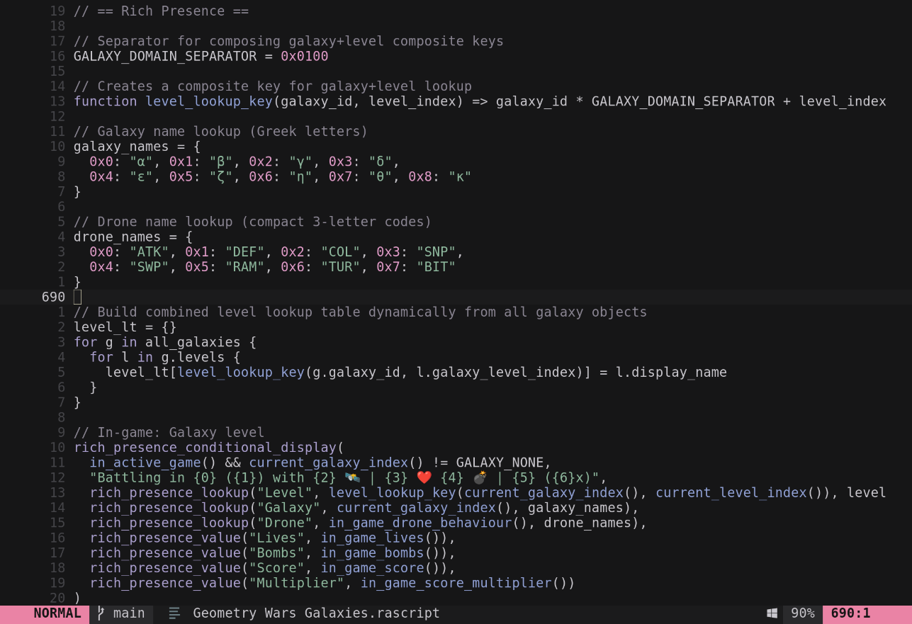

# vim-rascript

Vim plugin providing syntax highlighting and filetype detection for RAScript files (RetroAchievements scripts).



## Features

- Filetype detection for `.rascript` files
- Syntax highlighting for RAScript language

## Installation

### Using lazy.nvim

```lua
{ "zeapoz/vim-rascript" }
```

### Using Vim-plug

```vim
Plug 'zeapoz/vim-rascript'
```

## Syntax Highlighting

The plugin highlights:

| Element           | Example          | Highlight Group  |
|-------------------|------------------|------------------|
| Comments          | `// comment`     | `Comment`        |
| Strings           | `"text"`         | `String`         |
| Keywords          | `function`, `if` | `Keyword`        |
| Types             | `byte`, `word`   | `Type`           |
| Structure         | `once`, `never`  | `Structure`      |
| StorageClass      | `prev`, `prior`  | `StorageClass`   |
| Numbers           | `123`, `0xFF`    | `Number`         |
| Functions         | `foo()`          | `Function`       |
| Memory addresses  | `$160E64`        | `Identifier`     |

## License

MIT
